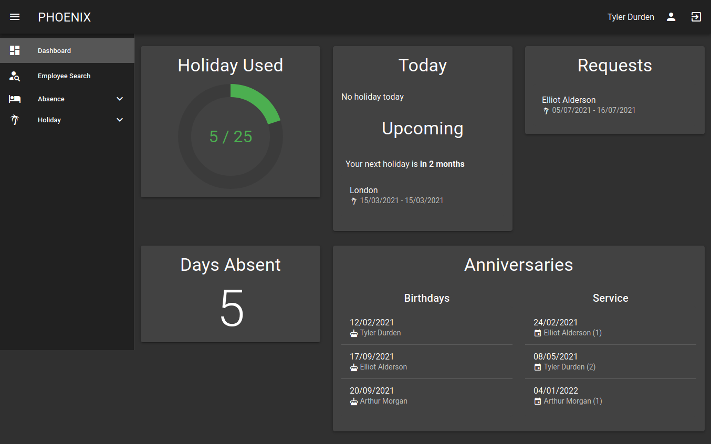
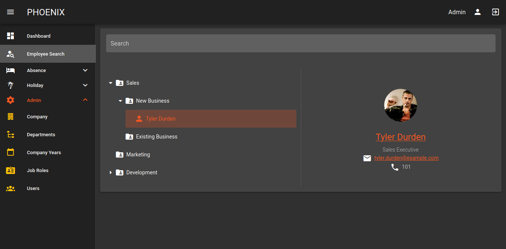
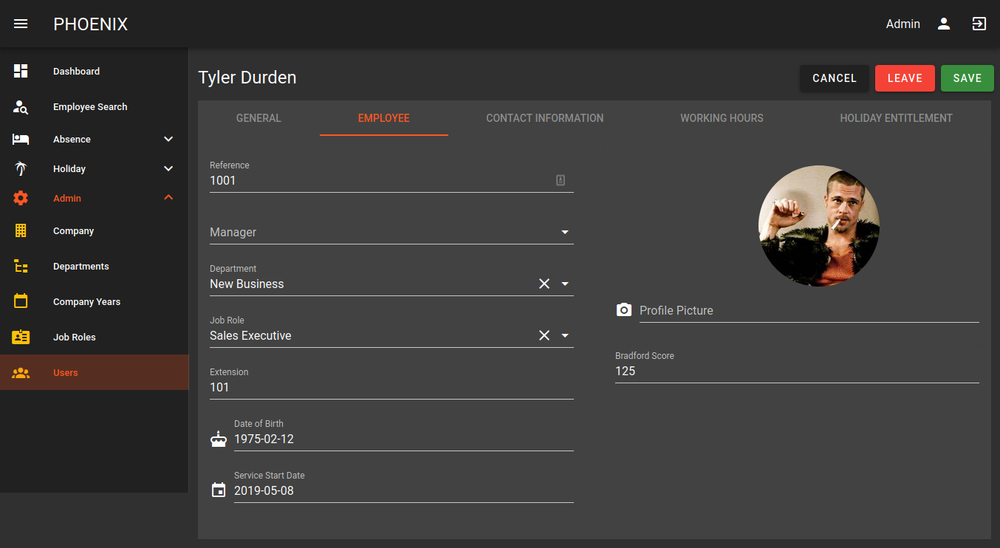

# HRMS

Webベースの人事管理システム


## Table of Contents

1. [Overview](#overview)
2. [Screenshots](#screenshots)
3. [Features](#features)
4. [Installation](#installation)
5. [Contribution](#contributing)

## Overview

Phoenixは一般的な人材要件をサポートするためのWebアプリケーションです。
アプリケーション層では、Spring Bootを使用しており、Spring Web MVC、Security、Data JPAを含んでいます。
フロントエンドはVueJSを使用しています。

## Screenshots

### Dashboard



### User Lookup



### Employee Record



## Features

以下は、主な特徴のリストです。
### Employee Database

従業員の詳細を記録し、写真、職務、マネージャー、部署、住所、休暇の権利を含めます。
電子メールアドレスと電話番号を含む連絡先のクイック検索を表示します。

### 休暇予約

従業員は自分の権限に基づいて休暇を申請することができ、管理者によって承認または拒否されることがあります。

### カレンダーフィード

各ユーザーは自分専用のiCal URLを持っており、Outlookなどのメールクライアントに休暇をインポートすることができます。

### 欠勤報告

従業員は欠勤を報告することができ、管理者によって承認または非承認されることがあります。

### LDAPと2要素認証

オプションのLDAPログインとTOTPコードを使用した2要素認証がサポートされています。

### マルチテナンシー

アプリケーションの1つのインスタンスで複数のクライアントをサポートします。

## インストール

アプリケーションを展開する最も簡単な方法はDocker Composeを使用することです。
プロジェクトにはサンプルの `docker-compose.yml` ファイルが含まれており、アプリケーションのビルドと展開が設定されています。

```shell
git clone https://github.com/mjp91/phoenix.git
cd phoenix

docker-compose up -d
```

### Production

`docker-compose.yml`ファイルに含まれるデフォルトのパスワードは変更する必要があります。  
NGINXプロキシコンテナをTLSを使用するように設定する必要があります。

### Configuration

Configuration properties are provided to the application through environment variables.

Name | Description
--- | ---
`SPRING_DATASOURCE_URL` | JDBC URL of primary database
`SPRING_DATASOURCE_DATA_USERNAME` | Database username of primary database
`SPRING_DATASOURCE_DATA_PASSWORD` | Database password of primary database
`HR_DATASOURCE_URL` | JDBC URL of secondary database
`HR_DATASOURCE_USERNAME` | Database username of secondary database
`HR_DATASOURCE_PASSWORD` | Database password of secondary database
`HR_ADMIN_PASSWORD` | Password of administrator user created on first run
`HR_JWT_SECRET` | Secret used to sign JWTs
`SPRING_MAIL_HOST` | (Optional) SMTP host for email
`SPRING_MAIL_PORT` | (Optional) SMTP port
`SPRING_MAIL_USERNAME` | (Optional) SMTP username
`SPRING_MAIL_PASSWORD` | (Optional) SMTP password
`SPRING_MAIL_PROPERTIES_MAIL_SMTP_AUTH` | (Optional) SMTP authentication
`SPRING_MAIL_PROPERTIES_MAIL_SMTP_STARTTLS_ENABLE` | (Optional) SMTP TLS

## Contributing

このリポジトリに貢献することは歓迎されています。

このリポジトリに貢献する場合は、変更内容を最初に問題、メール、またはその他の方法でこのリポジトリのオーナーと議論してから変更を行ってください。

### Build

#### Required Tools

- JDK 14
- NodeJS
- NPM/Yarn

#### Back-end

プロジェクトのルートから、ローカルにインストールされたMavenまたは含まれるラッパーを使用してください。
```shell
# compile
./mvnw clean package -DskipTests

# run
./mvnw spring-boot:run -Dspring-boot.run.profiles=dev
```

Back-end becomes available from http://localhost:8080.

#### Front-end

From the `ui` directory:

```shell
npm install

npm run serve
```

Front-end becomes available from http://localhost:8081.
